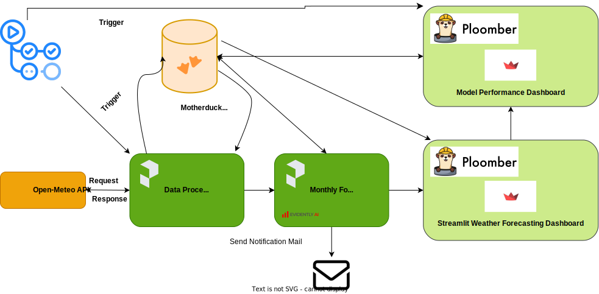

# ML Batch Job



## Objective:

The primary objective of this Machine Learning Batch Job project is to develop a robust and efficient machine learning pipeline for automating the training and deployment of models. The pipeline aims to streamline the end-to-end process of model development, training, evaluation, and deployment, ensuring scalability, reproducibility, and maintainability.

### Reproducibility:

A well-designed machine learning pipeline enables the recreation of experiments, ensuring that results can be reproduced consistently. This is crucial for debugging, validating models, and comparing different versions.

### Scalability:

Scalability is essential for handling large datasets and accommodating the growing complexity of machine learning models. An efficient pipeline can easily scale to handle increased volumes of data and computational demands.

### Automation:

Automation reduces manual intervention, minimizing the chances of errors and improving overall efficiency. A good pipeline automates tasks such as data preprocessing, model training, and deployment, allowing for seamless integration into production environments.

### Model Versioning:

Version control for models is vital for tracking changes, understanding model evolution, and rolling back to previous versions if needed. A well-designed pipeline facilitates proper versioning of models, making it easier to manage and maintain model lifecycle.

### Monitoring and Logging:

A good pipeline incorporates monitoring and logging functionalities, enabling tracking of model performance and system behavior. This is essential for identifying issues promptly, ensuring model health, and making informed decisions for model improvements.

## Project Description:

create a robust, simple, effecient, and modern end to end ML Batch Serving Pipeline Using set of modern open-source/free Platforms/Tools including
- [Free Weather API](https://open-meteo.com/)
- [MotherDuck](https://app.motherduck.com/)
- [Ploomber](https://ploomber.io/)
- [Prefect](https://www.prefect.io/)
- [EvidentlyAI](https://www.evidentlyai.com/)
- [DVC](https://dvc.org/)
- [Streamlit](https://streamlit.io/)
- Github Actions
- Python

the project will focus on the best technical implementation to solve the issues in production environment, and how to use the mensioned platforms and tools to build an end to end pipeline.

## Project Setup:

- create an account on the following platforms:
  - [MotherDuck](https://app.motherduck.com/)
  - [Ploomber](https://ploomber.io/)
- create motherduck token, and ploomber api key
- use this url: [Weather-API](https://archive-api.open-meteo.com/v1/archive) to get the data, and for more information please visit the documentation.
- install/use python>=3.10,<3.12
- install [Poetry](https://python-poetry.org/) dependancy management
- use `pyproject.toml` & `poetry.lock` files to install the project dependencies by
```bash
poetry install
```
- install Git & Make Command.
- add all your secret keys to github repository secrets, I added the following:
  - MOTHERDUCK_TOKEN
  - PLOOMBER_API_KEY
  - METERO_URL
feel free to add more based on your needs.

## Project Development:

### From API Data To MotherDuck:

this is a very important, and critical part in every ML lifecycle, of course as all of us know ML models can't work without a continous feed of data in production, this data must be similar to the data used in production, and updated to fire the model.

so, this part get the updated hourly API data everyday from source, and load it to MotherDuck Serverless Database.

this job schedualed using Github Actions to run everyday at specific time to get the data, and load it into the table in motherduck.

for more information about the implementation use the following:

- [From API Data To MotherDuck readme](app/api_data/README.md)

### Model Development:

ML Projects aren't a singular well-defined task, it is iterative process that can take months, or years to optimize model performance, meet business metrics, time complexity, and many other issues.

through model development journey many things can happen, that make development chaotic:

- many versions of experiments.
- no versioning for model artifacts, models, and data
- no unified platform to share results, data, and trails between multiple project developers.
- randomness, and updating code in experiments can produce many issues.

all of this reasons, must be considered when developing the model, and that's why using tools like **DVC, MLFlow, and many more** becomes very important, and skill that must be acquired by Data Scientists, and ML Engineers.

this project uses:

- **DVC**: 
  - for Data, model, and artifacts version control
  - automating training pipeline.
- **DVC-VSCode Extension**: for experiment tracking(DVC Studio can be used for Team.)

for more information about the implementation use the following:

- [Training Using DVC](app/train/README.md)