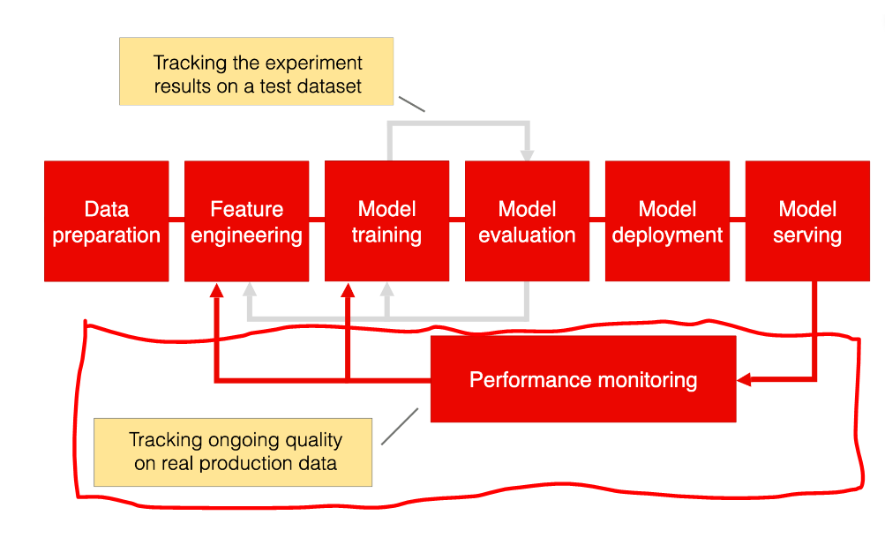

# Data Quality/Model Performance Monitoring:



in previous steps we covered [inference](../inference/) and how to get and prepare the data pipeline to be aggregated on a daily level in [data-pipeline](../api_data/), now we have all things we need to monitor performance.
now, data is extracted, prepared daily, and a model works monthly to forecast the next 30 days.

according to [evidentlyAI](https://www.evidentlyai.com/), to monitor performance, we need **reference dataset, and current dataset**, both used to create different, and wide-range of performance/statistical tests to compare the performance of model on current/new(production) data, and reference data(train).

daily temperature data, and forecasted data are stored in MotherDuck Database, first we need to get them using the following:
```SQL
SELECT t1.location_id,
       t1.reading_date,
       t1.forecasted_temperature,
       t2.temperature
FROM (
  SELECT location_id, 
         reading_date, 
         forecasted_temperature
  FROM ml_apps.weather_forecasting.daily_forecasted_weather
) AS t1
INNER JOIN (
  SELECT location_id, 
         reading_date, 
         temperature
  FROM ml_apps.weather_forecasting.daily_weather_data
) AS t2 ON t2.reading_date=t1.reading_date AND 
     t2.location_id = t1.location_id
WHERE t1.reading_date BETWEEN 
      CAST('{running_date}' AS DATE) - INTERVAL '32 days' 
      AND CAST('{running_date}' AS DATE) - INTERVAL '2 days';
```

this will get all needed data per data per location.

