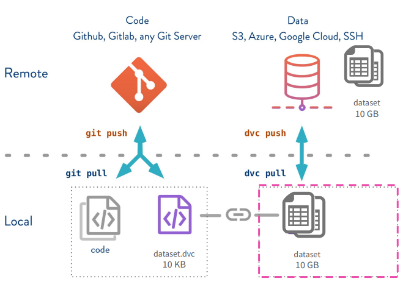
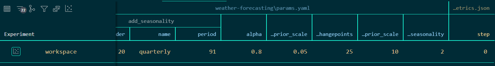

# DVC Training Pipeline:

DVC is the Git of **Data**, it is originally designed to track your data, artifacts, and models using the same concepts of Git to track your code.

Github, Gitlab, and other platform that are used for code-versioning, isn't designed for large-amount of data/models/artifacts that are input/results of machine learning development process, so it is very important to find something that give us the same advantage to track our data to make it accessable, sharable between team members, and versioned, DVC gives us this advantage, we can use remote/local storage (file-system/S3/HDFS) to store data/artifacts, and use DVC to push & pull data just like code with Git



to start tracking files on your project:

```bash
dvc init
```

after intializing DVC, all data/artifacts/models will be tracked, no you can start adding files:

```bash
dvc add .
```
adding files to DVC will create metadata files for all files that added to DVC, and add them to .gitignore.

intializing DVC will add .dvc, you must add & commit to git as well:

```bash
git add .
git commit -m "your message...."
```

now, let's configure the remote/local storage that will be used to store all files added to DVC:

```bash
# i used local storage in this project.
# first it created a directory on my machine using mkdir command, then used the following
dvc remote add -d localremote 'path/path_of_dir'
```

no push your files to remote/local stoarge:

```bash
dvc push
```

after many notebooks, and trails of machine learning experiments, it is effecient to convert the training notebooks to reusable code, so that we can automate the training, rather than converting every new change to new notebook that can make development between members missy if no naming protocol defined, also, to ensure reproducability when changing/updating pipeline.

to start converting notebooks to reusable code, let's follow the below steps:

- translate notebooks code to reusable code by creating every step needed to train models to functions/classes.
- now, convert notebooks to scripts (from `.ipynb` to `.py`), this directory contains all code used to automate training: [training](./)
- ensure that no hardcoded path/parameters in your reusable code, for this part move all parameters and paths to `.yml` file, to use it as an argument for your code, take a look at [params-file](../../conf/params.yaml)
- use DVC now to create `dvc.yaml` file that consists of all stages of training pipeline, to start create `dvc.yml` file and add stages use:

```bash
dvc stage add \
   -n <name of the stage> \
   -p <parameters> \
   -o <expected output file of stage> \
   -d <dependencies needed to run the stage> \
   <command to run the stage>
```

this will create file like this [automate-training](../../dvc.yaml) & add stage to your project

- after adding all stages needed for training pipeline, run the pipeline using:

```bash
dvc repro
```
this will run the pipeline, and skip the stages if no modifications applied to it.

automating training will save time, increase collaboration, and ensure reproducability, and this will make the training easy, accurate, and will increase number of experiments for all teams members.

now, we need a system to track all of this experiments(models, data, hyperparamsters, and more..), and make them sharable between developers to enhance collaboration, and get the latest, and best result.

**DVC** can be used as experiment tracking tool, it can be integrated with **DVC Studio**(to make experiments sharable between team members), or **DVC VSCode Extension**(used for single developer to visualize experiments & plots in UI).

I used VSCode Extension



